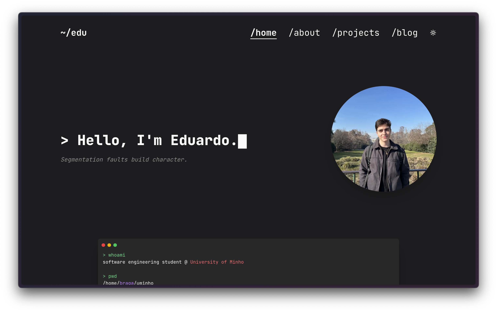

# Portfolio Website



## Overview

this is my personal portfolio website, showcasing my projects, skils, and some other cool stuff

## Technologies Used

- HTML dabbled up with some CSS
- Next.js
- Tailwind CSS

## Setup & Installation

```bash
# Clone the repository
git clone https://github.com/2101dudu/website.git

# Navigate into the project folder
cd website

# Install dependencies
npm install

# Run the development server
npm run dev
```

## Deployment

This website is deployed using [Vercel](vercel.com).

## License

This project is open-source under the [MIT License](LICENSE).
